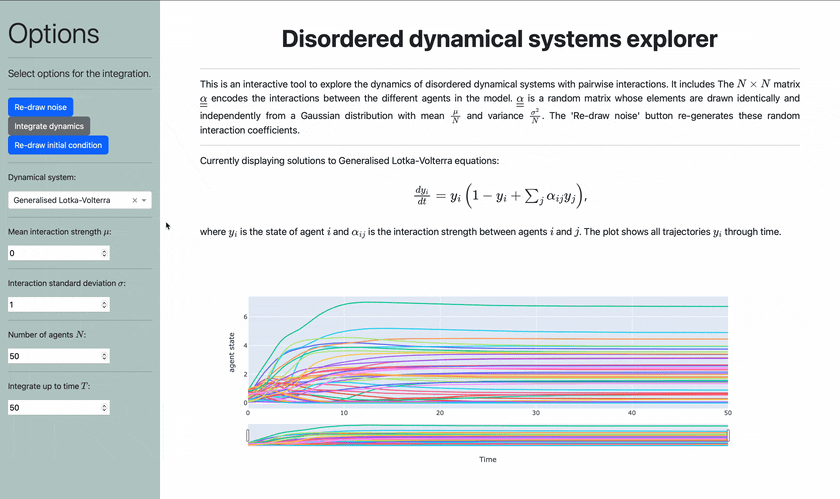

# Disordered dynamical system explorer



## Purpose
This is a dash app which is intended to help get an intuition for the behaviour of large disordered dynamical systems. Specifically, disordered dynamical systems which are composed of $N$ interacting agents $x_i(t)$ following dynamics of the form

$$
\frac{\mathrm dx_i}{\mathrm dt} = f\left(x_i, \sum_{j = 1, j\neq i}^N\alpha_{ij}x_j\right),
$$

where the interaction coefficients $\alpha_{ij}$ dictates the influence of agent $j$ on agent $i$. The coefficients $\alpha_{ij}$ are independent and identically distributed Gaussian random varliables with mean and variance

$$
\left\langle\alpha_{ij}\right\rangle = \frac{\mu}{N}, \hspace{1cm} \mathrm{Var}\left(\alpha_{ij}\right) = \frac{\sigma^2}{N}.
$$

Once the coefficients are drawn, the resulting dynamics are deterministic.


Each system which can be selected from the dropdown menu exhibits different dynamical behaviours depending on the interaction coefficients $\alpha_{ij}$. Generally speaking, if the variance of the interaction coefficients ($\sigma$) is small and the mean value ($\mu$) is negative, then the dynamics are likely to settle into a steady state. Increasing the variance of interactions can result in chaotic or oscillatory dynamics. Increasing the mean interaction strength to positive values can cause the dynamics to diverge in some cases.

For example, the Generalised Lotka-Volterra equations can exhibit the following three dynamical behaviours.
1. Setting $\mu=0$ and $\sigma=0.5$ is very likely to lead to dynamics which eventually settle into a steady state. Further, if the initial condition is re-drawn *without* redrawing the interaction matrix, then the corresponding dynamics will settle into the same steady state. In other words, the steady state is independent of the initial conditions.
2. Setting $\mu=-20$ and $\sigma=3$ is likely to produce dynamical systems which will either not settle into a steady state, or tha will settle into a steady state that *does* depend on the initial condition.
3. Setting $\mu=2$ and $\sigma=1$ is likely to produce dynamics which diverge. That is, the values of $y_i$ will eventually blow up to $\infty$.

## Running with poetry
If you already have poetry installed on your system:
1. Clone the repository to a local directory.
   ```sh
   git clone https://github.com/LylePoley/disordered-dynamical-systems
   ```
2. Open a terminal inside the directory.
   ```sh
   cd disordered-dynamical-systems
   ```
3. Create virtual environment with the required dependencies
   ```sh
   poetry install
   ```
4. Activate the virtual environment
   ```sh
   poetry env activate
   ```
5. Run the app
   ```sh
   poetry run python app/app.py
   ```
6. Once the app is running, open your browser and go to [http://localhost:8050](http://localhost:8050) to access the app. Note that you will also see a note in the terminal `Dash is running on http://0.0.0.0:8050/`. However, the linnk does not go anywhere and you shouldn't follow it.

If you don't have poetry, you can follow the instructions to install it [here](https://github.com/python-poetry/install.python-poetry.org).

Alternatively, you can read the dependencies off from `pyproject.toml`, and create a virtual environment yourself. The entry point is `app/app.py`.

## Running with Docker
To run the app using Docker, you can use the provided `Dockerfile` and `docker-compose.yml` files. This setup uses Python 3.10 and Poetry 1.8.2 to manage dependencies, and exposes the Dash app on port 8050.

### Build and Run
1. Ensure you have Docker and Docker Compose installed on your system.
2. In the project root directory, build and start the app with:
   ```sh
   docker compose up --build
   ```
3. Once the container is running, open your browser and go to [http://localhost:8050](http://localhost:8050) to access the app. Note that you will also see a note in the terminal `Dash is running on http://0.0.0.0:8050/`. However, the linnk does not go anywhere and you shouldn't follow it.

### Configuration
- No environment variables are required by default. If you need to set any, you can create a `.env` file and uncomment the `env_file` line in `docker-compose.yml`.
- No external services or persistent volumes are required for this project.

### Ports
- The Dash app is exposed on port `8050` (host: 8050 → container: 8050).

### Notes
- The Docker image is built using a multi-stage process for efficiency and runs as a non-root user for security.
- All dependencies are managed via Poetry and installed in an in-project virtual environment.
